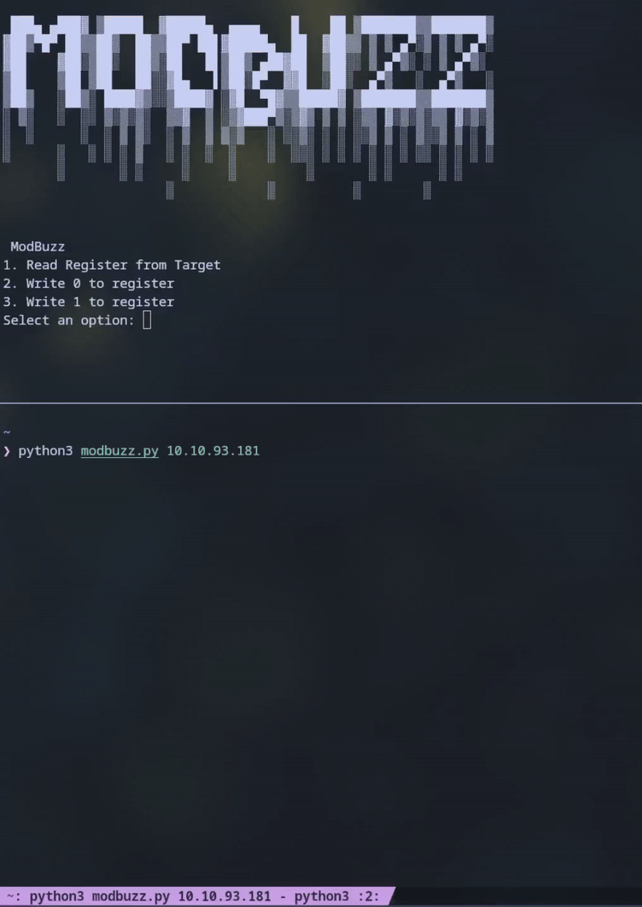

# ModBuzz
Modbuzz is a lightweight Python tool for interacting with Modbus TCP devices. It provides a simple terminal-based interface to read and write Modbus registers, making it useful for quick tests, debugging, or automation in industrial control environments.

✨ Features
Interactive Menu – Easy-to-use CLI menu for quick navigation.
Read Registers – Continuously read holding registers from a target Modbus TCP server.
Write Registers – Write either 0 or 1 to a specific register, with adjustable repeat count.

📦 Requirements
Python 3.x
pyModbusTCP
Install dependencies:
```
pip install pyModbusTCP
```
🚀 Usage
Run the tool by providing the target IP address of the Modbus device:
```
python3 modbuzz.py 192.168.2.1
```
🛠 Example

Read registers:
Select option 1, enter the register count and number of reads.

Write value:
Select option 2 or 3, enter the register address and how many times you want to write.



⚠️ Disclaimer

This tool is intended for educational and testing purposes only.
Do not use it on production systems or without explicit authorization.

Möchtest du, dass ich dir auch noch ein kurzes One-Liner-Repo-Tagline (für ganz oben in GitHub) schreibe, z. B. „Simple Modbus TCP CLI tool for testing and debugging“?
